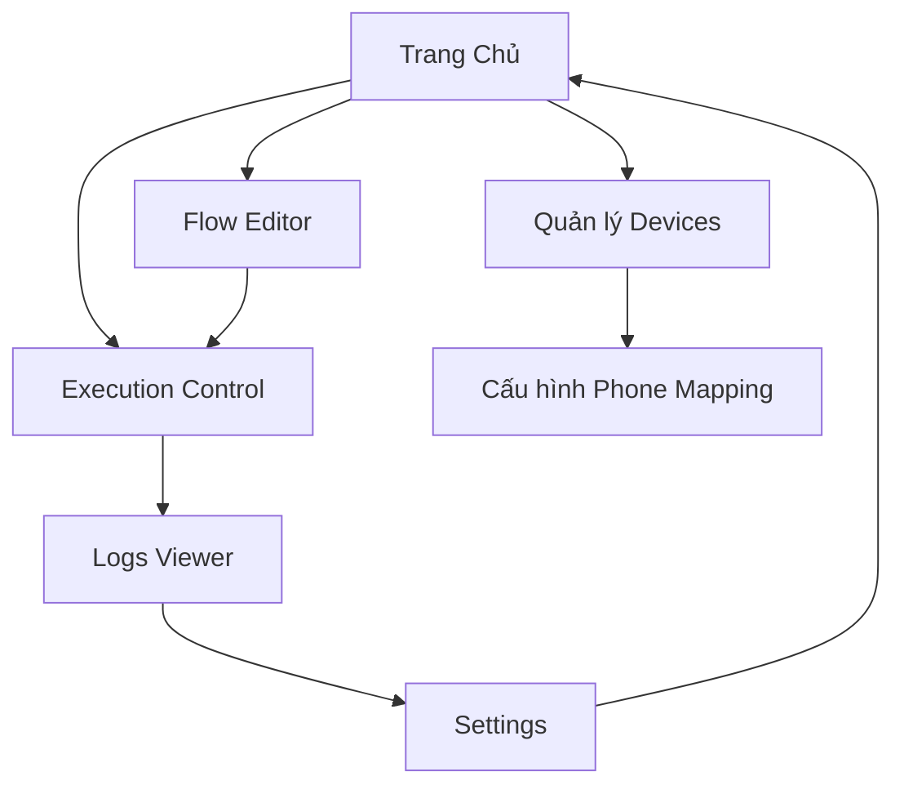

# Android Automation GUI Application - Yêu cầu Sản phẩm

## 1. Tổng quan Sản phẩm

Ứng dụng Windows Desktop GUI để quản lý và điều khiển automation Android devices thông qua giao diện đồ họa thân thiện. Chuyển đổi từ script command-line core1.py thành ứng dụng desktop hoàn chỉnh với khả năng quản lý multi-device, real-time monitoring và hot-reload automation flows.

Sản phẩm giải quyết vấn đề phức tạp trong việc sử dụng command-line tools, cung cấp giao diện trực quan cho việc quản lý automation Android devices, phục vụ các QA testers và automation engineers.

## 2. Tính năng Cốt lõi

### 2.1 Vai trò Người dùng

| Vai trò | Phương thức Đăng ký | Quyền Cốt lõi |
|---------|---------------------|----------------|
| QA Tester | Cài đặt ứng dụng trực tiếp | Có thể chạy automation flows, xem logs, quản lý devices |
| Automation Engineer | Cài đặt ứng dụng + cấu hình nâng cao | Có thể tạo/chỉnh sửa flows, cấu hình phone mapping, quản lý multi-device execution |

### 2.2 Module Tính năng

Ứng dụng Android Automation GUI bao gồm các trang chính sau:

1. **Trang Chủ**: dashboard tổng quan, device status, quick actions
2. **Quản lý Devices**: danh sách devices, kết nối/ngắt kết nối, device info
3. **Cấu hình Phone Mapping**: mapping IP addresses với phone numbers
4. **Flow Editor**: tạo/chỉnh sửa automation flows với syntax highlighting
5. **Execution Control**: chạy flows trên single/multi devices, real-time monitoring
6. **Logs Viewer**: xem logs real-time với filtering và search
7. **Settings**: cấu hình ứng dụng, ADB settings, preferences

### 2.3 Chi tiết Trang

| Tên Trang | Tên Module | Mô tả Tính năng |
|-----------|------------|------------------|
| Trang Chủ | Dashboard | Hiển thị tổng quan devices connected, recent executions, quick start buttons |
| Trang Chủ | Device Status Panel | Hiển thị real-time status của tất cả devices (connected/disconnected/busy) |
| Trang Chủ | Quick Actions | Buttons để start/stop executions, refresh devices, open recent flows |
| Quản lý Devices | Device List | Hiển thị danh sách tất cả devices với thông tin chi tiết (IP, model, resolution) |
| Quản lý Devices | Connection Control | Connect/disconnect devices, test connection, view device screenshots |
| Quản lý Devices | Device Info | Hiển thị thông tin chi tiết device (specs, screen info, installed apps) |
| Cấu hình Phone Mapping | Mapping Table | Bảng mapping IP addresses với phone numbers, add/edit/delete entries |
| Cấu hình Phone Mapping | Import/Export | Import từ JSON file, export cấu hình, backup/restore settings |
| Flow Editor | Code Editor | Editor với syntax highlighting cho Python automation flows |
| Flow Editor | Flow Templates | Pre-built templates cho common automation tasks |
| Flow Editor | Hot-reload Support | Tự động reload flows khi file thay đổi, live preview |
| Execution Control | Single Device Execution | Chạy flow trên một device được chọn |
| Execution Control | Multi-device Execution | Chạy flow đồng thời trên nhiều devices với group coordination |
| Execution Control | Real-time Monitoring | Monitor execution progress, device status, error handling |
| Logs Viewer | Real-time Logs | Hiển thị logs real-time từ tất cả devices với color coding |
| Logs Viewer | Log Filtering | Filter logs theo device, level (info/warning/error), time range |
| Logs Viewer | Export Logs | Export logs to file, search functionality, log archiving |
| Settings | ADB Configuration | Cấu hình ADB path, connection settings, timeout values |
| Settings | UI Preferences | Theme selection, font size, layout preferences |
| Settings | Advanced Settings | Debug mode, logging level, performance settings |

## 3. Quy trình Cốt lõi

**Quy trình QA Tester:**
1. Khởi động ứng dụng → Trang Chủ hiển thị dashboard
2. Kiểm tra devices connected → Quản lý Devices để xem status
3. Chọn automation flow → Flow Editor để select/preview flow
4. Chạy execution → Execution Control để start flow
5. Monitor progress → Logs Viewer để theo dõi real-time

**Quy trình Automation Engineer:**
1. Khởi động ứng dụng → Trang Chủ
2. Cấu hình phone mapping → Cấu hình Phone Mapping
3. Tạo/chỉnh sửa flows → Flow Editor với advanced features
4. Setup multi-device execution → Execution Control với group settings
5. Monitor và debug → Logs Viewer với advanced filtering
6. Cấu hình system → Settings cho optimization

## 4. Thiết kế Giao diện Người dùng

### 4.1 Phong cách Thiết kế

- **Màu sắc chính**: #2563EB (Blue), màu phụ: #10B981 (Green), #EF4444 (Red), #F59E0B (Orange)
- **Phong cách Button**: Modern flat design với rounded corners, hover effects
- **Font**: Segoe UI (Windows), size 10-12pt cho text, 14-16pt cho headers
- **Phong cách Layout**: Modern dashboard với sidebar navigation, card-based content areas
- **Icons**: Material Design icons, emoji support cho status indicators (📱, ✅, ❌, ⚠️)

### 4.2 Tổng quan Thiết kế Trang

| Tên Trang | Tên Module | Các Thành phần UI |
|-----------|------------|-------------------|
| Trang Chủ | Dashboard | Grid layout với cards, device status indicators, progress bars, action buttons với icons |
| Trang Chủ | Device Status Panel | List view với color-coded status (green=connected, red=disconnected, orange=busy) |
| Quản lý Devices | Device List | Table với sortable columns, search box, refresh button, connection status icons |
| Quản lý Devices | Connection Control | Action buttons, device screenshots preview, connection test results |
| Cấu hình Phone Mapping | Mapping Table | Editable table với add/delete buttons, validation indicators, import/export buttons |
| Flow Editor | Code Editor | Syntax-highlighted text editor, line numbers, search/replace, file tree sidebar |
| Flow Editor | Flow Templates | Template gallery với preview, drag-drop functionality |
| Execution Control | Execution Panel | Start/stop buttons, device selection checkboxes, progress indicators, status messages |
| Logs Viewer | Log Display | Scrollable text area với color-coded messages, timestamp column, filter controls |
| Settings | Configuration Forms | Tabbed interface với form controls, apply/reset buttons, validation messages |

### 4.3 Responsive Design

Ứng dụng được thiết kế desktop-first với minimum resolution 1024x768, hỗ trợ window resizing và multi-monitor setups. Giao diện tối ưu cho mouse interaction với keyboard shortcuts support.