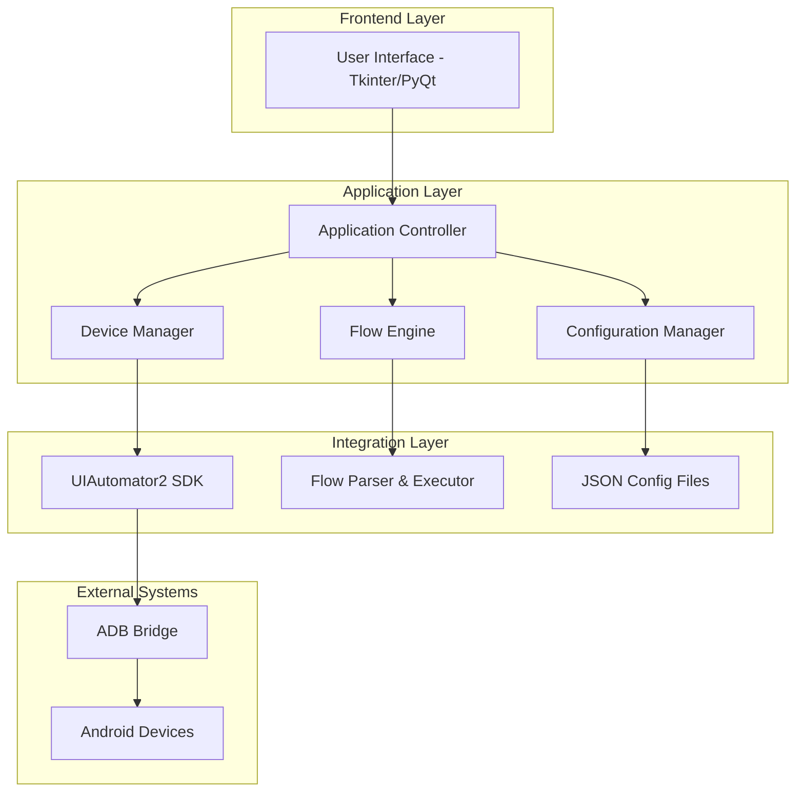
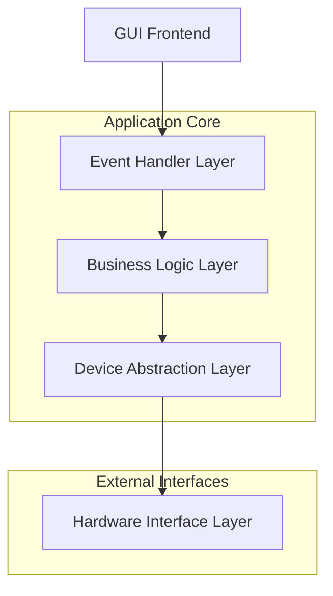
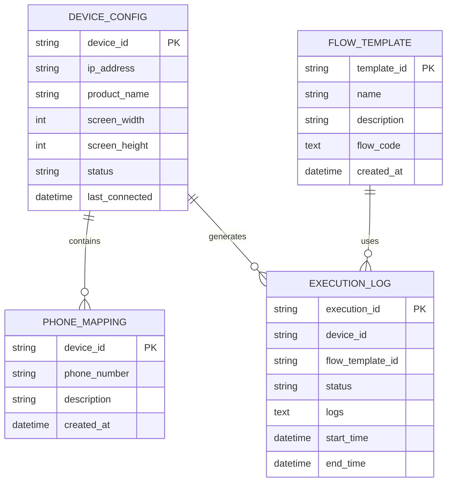

## 1. Thiết kế Kiến trúc



## 2. Mô tả Công nghệ

- Frontend: PyQt6 + QtDesigner cho modern GUI, threading support
- Backend: Python 3.8+ với uiautomator2, watchdog cho file monitoring
- Configuration: JSON files cho device mapping, settings, flow templates
- Packaging: PyInstaller cho tạo executable files
- Dependencies: uiautomator2, PyQt6, watchdog, psutil, colorama

## 3. Định nghĩa Routes

| Route | Mục đích |
|-------|----------|
| /main | Main window với dashboard và navigation sidebar |
| /devices | Device management window với device list và controls |
| /mapping | Phone mapping configuration window |
| /editor | Flow editor window với code editor và templates |
| /execution | Execution control window với real-time monitoring |
| /logs | Logs viewer window với filtering và search |
| /settings | Application settings và preferences window |

## 4. Định nghĩa API

### 4.1 Core API

Device Management API
```python
class DeviceManager:
    def get_connected_devices() -> List[DeviceInfo]
    def connect_device(device_id: str) -> bool
    def disconnect_device(device_id: str) -> bool
    def get_device_info(device_id: str) -> DeviceInfo
    def take_screenshot(device_id: str) -> str
```

Request DeviceInfo:
| Param Name | Param Type | isRequired | Description |
|------------|------------|------------|-------------|
| device_id | string | true | Device identifier (IP:port or USB ID) |
| product_name | string | true | Device product name |
| screen_width | integer | true | Screen width in pixels |
| screen_height | integer | true | Screen height in pixels |
| status | string | true | Connection status (connected/disconnected/busy) |

Flow Execution API
```python
class FlowExecutor:
    def execute_flow(flow_code: str, devices: List[str]) -> ExecutionResult
    def stop_execution(execution_id: str) -> bool
    def get_execution_status(execution_id: str) -> ExecutionStatus
```

Request ExecutionResult:
| Param Name | Param Type | Description |
|------------|------------|-------------|
| execution_id | string | Unique execution identifier |
| status | string | Execution status (running/completed/failed) |
| devices | List[string] | List of target devices |
| start_time | datetime | Execution start timestamp |
| logs | List[LogEntry] | Execution logs |

Configuration API
```python
class ConfigManager:
    def load_phone_mapping() -> Dict[str, str]
    def save_phone_mapping(mapping: Dict[str, str]) -> bool
    def load_settings() -> AppSettings
    def save_settings(settings: AppSettings) -> bool
```

## 5. Sơ đồ Kiến trúc Server



## 6. Mô hình Dữ liệu

### 6.1 Định nghĩa Mô hình Dữ liệu



### 6.2 Định nghĩa Ngôn ngữ Dữ liệu

Device Configuration (device_config.json)
```json
{
  "devices": [
    {
      "device_id": "192.168.5.74:5555",
      "ip_address": "192.168.5.74",
      "product_name": "Samsung Galaxy",
      "screen_width": 1080,
      "screen_height": 2220,
      "status": "connected",
      "last_connected": "2024-01-15T10:30:00Z"
    }
  ]
}
```

Phone Mapping (phone_mapping.json)
```json
{
  "phone_mapping": {
    "192.168.5.74": "569924311",
    "192.168.5.82": "583563439"
  },
  "timestamp": 1705312200,
  "created_by": "Android Automation GUI"
}
```

Flow Templates (flow_templates.json)
```json
{
  "templates": [
    {
      "template_id": "zalo_login",
      "name": "Zalo Login Flow",
      "description": "Automated Zalo login process",
      "flow_code": "def flow(dev):\n    # Login automation code\n    pass",
      "created_at": "2024-01-15T10:30:00Z"
    }
  ]
}
```

Application Settings (app_settings.json)
```json
{
  "adb_path": "C:\\platform-tools\\adb.exe",
  "default_timeout": 10,
  "log_level": "INFO",
  "theme": "light",
  "font_size": 12,
  "auto_refresh_devices": true,
  "max_log_entries": 1000
}
```

Execution Logs (execution_logs.json)
```json
{
  "executions": [
    {
      "execution_id": "exec_20240115_103000",
      "device_id": "192.168.5.74:5555",
      "flow_template_id": "zalo_login",
      "status": "completed",
      "logs": [
        {
          "timestamp": "2024-01-15T10:30:05Z",
          "level": "INFO",
          "message": "Device connected successfully"
        }
      ],
      "start_time": "2024-01-15T10:30:00Z",
      "end_time": "2024-01-15T10:32:00Z"
    }
  ]
}
```