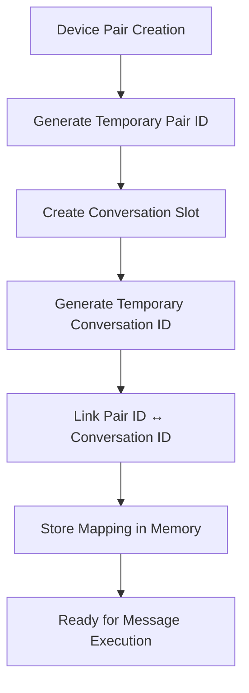
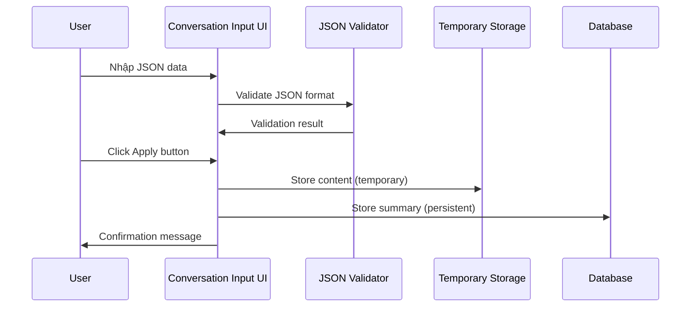

# Conversation Management Design - Zalo Automation System

## 1. Tổng quan hệ thống

Hệ thống conversation management được thiết kế để quản lý việc ghép cặp thiết bị với các cuộc hội thoại, xử lý dữ liệu JSON input, và lưu trữ summary với logic cleanup tự động.

### 1.1 Mục tiêu chính
- Đảm bảo mỗi cặp thiết bị sử dụng 1 conversation duy nhất
- Quản lý temporary ID mapping giữa device pairs và conversations
- Xử lý JSON input format theo chuẩn demo.json
- Lưu trữ và quản lý summary với giới hạn 3 entries gần nhất per pair

## 2. Device Pair & Conversation Linking System

### 2.1 Kiến trúc Linking


### 2.2 ID Mapping Logic
- **Temporary Pair ID**: Format `pair_temp_{timestamp}_{random}`
- **Temporary Conversation ID**: Format `conv_temp_{timestamp}_{random}`
- **Mapping Storage**: In-memory dictionary cho session hiện tại
- **Persistence**: Chỉ summary được lưu vào database, mapping tạm thời

### 2.3 Unique Conversation Guarantee
```typescript
interface PairConversationMapping {
  tempPairId: string;
  tempConversationId: string;
  deviceA: string;
  deviceB: string;
  createdAt: Date;
  isActive: boolean;
}

// Logic đảm bảo unique conversation
function ensureUniqueConversation(deviceA: string, deviceB: string): string {
  // Check existing mapping (AB hoặc BA)
  const existingMapping = findExistingMapping(deviceA, deviceB);
  if (existingMapping) {
    return existingMapping.tempConversationId;
  }
  
  // Tạo mới nếu chưa có
  return createNewConversationMapping(deviceA, deviceB);
}
```

## 3. JSON Input Format & Processing

### 3.1 JSON Structure (theo demo.json lines 4-71)
```json
{
  "content": {
    "messages": [
      {
        "sender": "A",
        "text": "Nội dung tin nhắn",
        "timestamp": "2024-01-01T10:00:00Z"
      }
    ],
    "metadata": {
      "total_messages": 65,
      "duration": "2 hours"
    }
  },
  "summary": {
    "noidung": "Tóm tắt nội dung cuộc trò chuyện",
    "hoancanh": "Bối cảnh và hoàn cảnh",
    "so_cau": 65
  }
}
```

### 3.2 Processing Workflow


### 3.3 Data Processing Logic
```typescript
interface ConversationInput {
  content: {
    messages: Message[];
    metadata: any;
  };
  summary: {
    noidung: string;
    hoancanh: string;
    so_cau: number;
  };
}

function processConversationInput(input: ConversationInput, pairId: string) {
  // 1. Validate JSON structure
  validateJsonStructure(input);
  
  // 2. Store content temporarily
  temporaryStorage.setContent(pairId, input.content);
  
  // 3. Store summary persistently
  saveSummaryToDatabase(pairId, input.summary);
  
  // 4. Cleanup old summaries (keep only 3 latest)
  cleanupOldSummaries(pairId);
}
```

## 4. Summary Management System

### 4.1 Database Schema
```sql
-- Device Pairs Table
CREATE TABLE device_pairs (
    id UUID PRIMARY KEY DEFAULT gen_random_uuid(),
    device_a VARCHAR(50) NOT NULL,
    device_b VARCHAR(50) NOT NULL,
    pair_hash VARCHAR(64) UNIQUE NOT NULL, -- MD5(sorted(deviceA, deviceB))
    created_at TIMESTAMP WITH TIME ZONE DEFAULT NOW(),
    updated_at TIMESTAMP WITH TIME ZONE DEFAULT NOW()
);

-- Conversations Table
CREATE TABLE conversations (
    id UUID PRIMARY KEY DEFAULT gen_random_uuid(),
    pair_id UUID REFERENCES device_pairs(id) ON DELETE CASCADE,
    temp_conversation_id VARCHAR(100),
    content JSONB, -- Temporary storage
    created_at TIMESTAMP WITH TIME ZONE DEFAULT NOW()
);

-- Summaries Table
CREATE TABLE conversation_summaries (
    id UUID PRIMARY KEY DEFAULT gen_random_uuid(),
    pair_id UUID REFERENCES device_pairs(id) ON DELETE CASCADE,
    noidung TEXT NOT NULL,
    hoancanh TEXT NOT NULL,
    so_cau INTEGER NOT NULL,
    created_at TIMESTAMP WITH TIME ZONE DEFAULT NOW()
);

-- Indexes
CREATE INDEX idx_device_pairs_hash ON device_pairs(pair_hash);
CREATE INDEX idx_summaries_pair_created ON conversation_summaries(pair_id, created_at DESC);
CREATE INDEX idx_conversations_pair ON conversations(pair_id);
```

### 4.2 Summary Cleanup Logic
```typescript
class SummaryManager {
  private readonly MAX_SUMMARIES_PER_PAIR = 3;
  
  async saveSummary(pairId: string, summary: SummaryData): Promise<void> {
    // 1. Save new summary
    await this.insertSummary(pairId, summary);
    
    // 2. Get current count
    const count = await this.getSummaryCount(pairId);
    
    // 3. Cleanup if exceeds limit
    if (count > this.MAX_SUMMARIES_PER_PAIR) {
      await this.cleanupOldSummaries(pairId);
    }
  }
  
  private async cleanupOldSummaries(pairId: string): Promise<void> {
    const query = `
      DELETE FROM conversation_summaries 
      WHERE pair_id = $1 
      AND id NOT IN (
        SELECT id FROM conversation_summaries 
        WHERE pair_id = $1 
        ORDER BY created_at DESC 
        LIMIT $2
      )
    `;
    await db.query(query, [pairId, this.MAX_SUMMARIES_PER_PAIR]);
  }
}
```

### 4.3 Pair Matching Logic
```typescript
function findPairId(deviceA: string, deviceB: string): string {
  // Tạo hash cho cặp thiết bị (AB = BA)
  const devices = [deviceA, deviceB].sort();
  const pairHash = md5(devices.join('_'));
  
  // Tìm hoặc tạo pair
  return findOrCreatePair(devices[0], devices[1], pairHash);
}

function getLatestSummary(pairId: string): Promise<SummaryData | null> {
  const query = `
    SELECT noidung, hoancanh, so_cau, created_at
    FROM conversation_summaries 
    WHERE pair_id = $1 
    ORDER BY created_at DESC 
    LIMIT 1
  `;
  return db.queryOne(query, [pairId]);
}
```

## 5. API Design

### 5.1 Core Endpoints
```typescript
// Device Pair Management
POST /api/pairs/create
GET /api/pairs/:pairId/summaries
DELETE /api/pairs/:pairId

// Conversation Management
POST /api/conversations/input
GET /api/conversations/:conversationId
PUT /api/conversations/:conversationId/content

// Summary Management
POST /api/summaries/save
GET /api/summaries/latest/:pairId
DELETE /api/summaries/:summaryId
```

### 5.2 API Implementation
```typescript
// POST /api/conversations/input
interface ConversationInputRequest {
  pairId: string;
  conversationData: ConversationInput;
}

interface ConversationInputResponse {
  success: boolean;
  tempConversationId: string;
  summaryId: string;
  message: string;
}

async function handleConversationInput(req: ConversationInputRequest): Promise<ConversationInputResponse> {
  try {
    // 1. Validate input
    validateConversationInput(req.conversationData);
    
    // 2. Generate temp conversation ID
    const tempConversationId = generateTempConversationId();
    
    // 3. Store content temporarily
    await storeTemporaryContent(req.pairId, tempConversationId, req.conversationData.content);
    
    // 4. Save summary to database
    const summaryId = await saveSummary(req.pairId, req.conversationData.summary);
    
    // 5. Cleanup old summaries
    await cleanupOldSummaries(req.pairId);
    
    return {
      success: true,
      tempConversationId,
      summaryId,
      message: 'Conversation data processed successfully'
    };
  } catch (error) {
    throw new Error(`Failed to process conversation input: ${error.message}`);
  }
}
```

## 6. UI/UX Design

### 6.1 Conversation Input Interface
```tsx
interface ConversationInputProps {
  selectedPairId: string | null;
  onApply: (data: ConversationInput) => void;
}

function ConversationInputComponent({ selectedPairId, onApply }: ConversationInputProps) {
  const [jsonInput, setJsonInput] = useState('');
  const [validationError, setValidationError] = useState('');
  const [latestSummary, setLatestSummary] = useState<SummaryData | null>(null);
  
  // Load latest summary when pair selected
  useEffect(() => {
    if (selectedPairId) {
      loadLatestSummary(selectedPairId);
    }
  }, [selectedPairId]);
  
  const handleApply = () => {
    try {
      const data = JSON.parse(jsonInput);
      validateJsonStructure(data);
      onApply(data);
      setJsonInput(''); // Clear after apply
    } catch (error) {
      setValidationError(error.message);
    }
  };
  
  return (
    <div className="conversation-input-panel">
      {/* Pair Selection */}
      <div className="pair-selector">
        <label>Chọn cặp thiết bị:</label>
        <PairDropdown selectedPairId={selectedPairId} />
      </div>
      
      {/* Latest Summary Display */}
      {latestSummary && (
        <div className="latest-summary">
          <h4>Summary gần nhất:</h4>
          <div className="summary-content">
            <p><strong>Nội dung:</strong> {latestSummary.noidung}</p>
            <p><strong>Hoàn cảnh:</strong> {latestSummary.hoancanh}</p>
            <p><strong>Số câu:</strong> {latestSummary.so_cau}</p>
          </div>
        </div>
      )}
      
      {/* JSON Input */}
      <div className="json-input-section">
        <label>Nhập dữ liệu conversation (JSON):</label>
        <textarea
          value={jsonInput}
          onChange={(e) => setJsonInput(e.target.value)}
          placeholder="Paste JSON data here..."
          rows={15}
          className="json-textarea"
        />
        {validationError && (
          <div className="error-message">{validationError}</div>
        )}
      </div>
      
      {/* Action Buttons */}
      <div className="action-buttons">
        <button 
          onClick={handleApply}
          disabled={!selectedPairId || !jsonInput.trim()}
          className="apply-btn"
        >
          Apply
        </button>
        <button 
          onClick={() => setJsonInput('')}
          className="clear-btn"
        >
          Clear
        </button>
        <button 
          onClick={() => loadFromFile()}
          className="load-file-btn"
        >
          Load from File
        </button>
      </div>
    </div>
  );
}
```

### 6.2 Summary Display Component
```tsx
interface SummaryDisplayProps {
  pairId: string;
}

function SummaryDisplay({ pairId }: SummaryDisplayProps) {
  const [summaries, setSummaries] = useState<SummaryData[]>([]);
  
  useEffect(() => {
    loadSummaries(pairId);
  }, [pairId]);
  
  return (
    <div className="summary-display">
      <h3>Summaries (3 gần nhất)</h3>
      {summaries.map((summary, index) => (
        <div key={summary.id} className={`summary-item ${index === 0 ? 'latest' : ''}`}>
          <div className="summary-header">
            <span className="summary-index">#{index + 1}</span>
            <span className="summary-date">{formatDate(summary.created_at)}</span>
          </div>
          <div className="summary-content">
            <p><strong>Nội dung:</strong> {summary.noidung}</p>
            <p><strong>Hoàn cảnh:</strong> {summary.hoancanh}</p>
            <p><strong>Số câu:</strong> {summary.so_cau}</p>
          </div>
        </div>
      ))}
    </div>
  );
}
```

## 7. Implementation Plan

### 7.1 Phase 1: Database & Backend
1. Tạo database schema
2. Implement SummaryManager class
3. Tạo API endpoints
4. Unit tests cho logic cleanup

### 7.2 Phase 2: Frontend Integration
1. Tạo ConversationInputComponent
2. Implement JSON validation
3. Integrate với existing pair management
4. Add summary display

### 7.3 Phase 3: Testing & Optimization
1. End-to-end testing
2. Performance optimization
3. Error handling improvements
4. UI/UX refinements

## 8. Error Handling & Edge Cases

### 8.1 JSON Validation Errors
- Invalid JSON format
- Missing required fields
- Invalid data types
- Content/summary structure mismatch

### 8.2 Database Constraints
- Pair ID not found
- Summary limit exceeded
- Concurrent access issues
- Database connection failures

### 8.3 UI Edge Cases
- Large JSON files
- Network timeouts
- Pair selection changes during input
- Multiple apply clicks

## 9. Security Considerations

### 9.1 Input Validation
- JSON size limits
- Content sanitization
- SQL injection prevention
- XSS protection

### 9.2 Access Control
- User authentication
- Pair ownership validation
- Rate limiting
- Audit logging

Hệ thống này đảm bảo quản lý conversation hiệu quả với logic cleanup tự động và UI thân thiện cho việc nhập dữ liệu JSON.