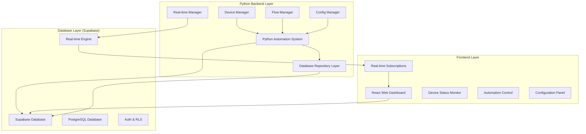
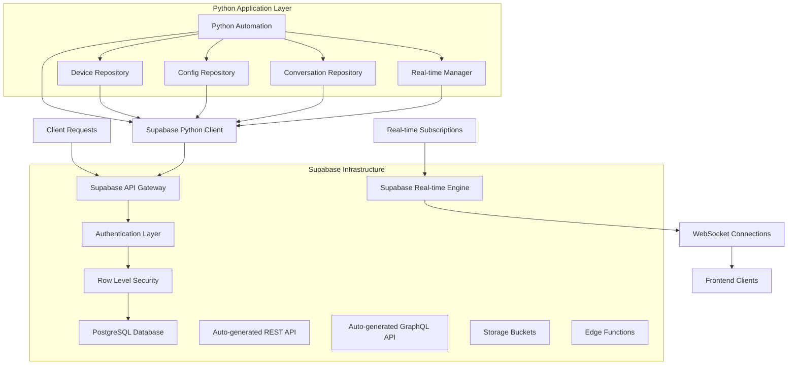
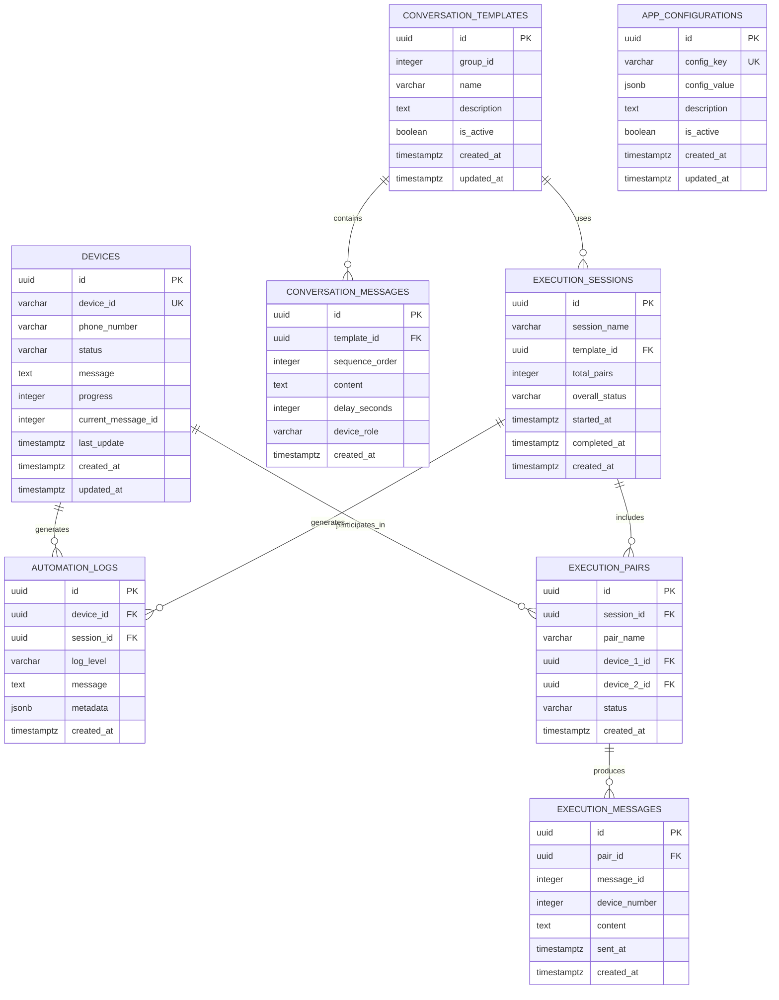

# Technical Architecture Document - Supabase Migration

## 1. Architecture Design



## 2. Technology Description

- **Frontend**: React@18 + Next.js@15 + TailwindCSS@3 + Supabase Client
- **Backend**: Python@3.9+ + Supabase Python Client + uiautomator2
- **Database**: Supabase (PostgreSQL) with Real-time subscriptions
- **Real-time**: Supabase Real-time Engine (WebSocket-based)

## 3. Route Definitions

| Route | Purpose |
|-------|---------|
| `/` | Dashboard home - device status overview |
| `/devices` | Device management and configuration |
| `/automation` | Automation flow control and monitoring |
| `/conversations` | Conversation template management |
| `/logs` | Execution logs and debugging |
| `/settings` | Application configuration |

## 4. API Definitions

### 4.1 Supabase Database API

**Device Management**
```typescript
// Get all devices
GET /rest/v1/devices
Response: Device[]

// Update device status
PATCH /rest/v1/devices?device_id=eq.{device_id}
Request: {
  status: string,
  message: string,
  progress: number,
  current_message_id?: number
}

// Real-time device updates
WebSocket: /realtime/v1
Channel: device-updates
Event: postgres_changes
```

**Conversation Management**
```typescript
// Get conversation templates
GET /rest/v1/conversation_templates?is_active=eq.true
Response: ConversationTemplate[]

// Get conversation messages
GET /rest/v1/conversation_messages?template_id=eq.{template_id}&order=sequence_order
Response: ConversationMessage[]

// Create execution session
POST /rest/v1/execution_sessions
Request: {
  session_name: string,
  template_id: string,
  total_pairs: number
}
```

**Configuration Management**
```typescript
// Get configuration
GET /rest/v1/app_configurations?config_key=eq.{key}
Response: AppConfiguration

// Update configuration
PATCH /rest/v1/app_configurations?config_key=eq.{key}
Request: {
  config_value: object,
  updated_at: string
}
```

### 4.2 Core Type Definitions

```typescript
interface Device {
  id: string;
  device_id: string;
  phone_number?: string;
  status: 'idle' | 'running' | 'completed' | 'error';
  message?: string;
  progress: number;
  current_message_id?: number;
  last_update: string;
  created_at: string;
  updated_at: string;
}

interface ConversationTemplate {
  id: string;
  group_id: number;
  name: string;
  description?: string;
  is_active: boolean;
  created_at: string;
  updated_at: string;
}

interface ConversationMessage {
  id: string;
  template_id: string;
  sequence_order: number;
  content: string;
  delay_seconds: number;
  device_role: 'device_a' | 'device_b';
  created_at: string;
}

interface ExecutionSession {
  id: string;
  session_name: string;
  template_id: string;
  total_pairs: number;
  overall_status: 'pending' | 'running' | 'completed' | 'error';
  started_at: string;
  completed_at?: string;
  created_at: string;
}

interface ExecutionPair {
  id: string;
  session_id: string;
  pair_name: string;
  device_1_id: string;
  device_2_id: string;
  status: 'pending' | 'running' | 'completed' | 'error';
  created_at: string;
}

interface AppConfiguration {
  id: string;
  config_key: string;
  config_value: object;
  description?: string;
  is_active: boolean;
  created_at: string;
  updated_at: string;
}

interface AutomationLog {
  id: string;
  device_id?: string;
  session_id?: string;
  log_level: 'INFO' | 'ERROR' | 'DEBUG' | 'WARNING';
  message: string;
  metadata?: object;
  created_at: string;
}
```

## 5. Server Architecture Diagram



## 6. Data Model

### 6.1 Data Model Definition



### 6.2 Data Definition Language

**Devices Table**
```sql
CREATE TABLE devices (
    id UUID PRIMARY KEY DEFAULT gen_random_uuid(),
    device_id VARCHAR(50) UNIQUE NOT NULL,
    phone_number VARCHAR(20),
    status VARCHAR(20) DEFAULT 'idle' CHECK (status IN ('idle', 'running', 'completed', 'error')),
    message TEXT,
    progress INTEGER DEFAULT 0 CHECK (progress >= 0 AND progress <= 100),
    current_message_id INTEGER,
    last_update TIMESTAMP WITH TIME ZONE DEFAULT NOW(),
    created_at TIMESTAMP WITH TIME ZONE DEFAULT NOW(),
    updated_at TIMESTAMP WITH TIME ZONE DEFAULT NOW()
);

-- Trigger to update updated_at
CREATE OR REPLACE FUNCTION update_updated_at_column()
RETURNS TRIGGER AS $$
BEGIN
    NEW.updated_at = NOW();
    RETURN NEW;
END;
$$ language 'plpgsql';

CREATE TRIGGER update_devices_updated_at BEFORE UPDATE ON devices
    FOR EACH ROW EXECUTE FUNCTION update_updated_at_column();
```

**Conversation Templates and Messages**
```sql
CREATE TABLE conversation_templates (
    id UUID PRIMARY KEY DEFAULT gen_random_uuid(),
    group_id INTEGER NOT NULL,
    name VARCHAR(100) NOT NULL,
    description TEXT,
    is_active BOOLEAN DEFAULT true,
    created_at TIMESTAMP WITH TIME ZONE DEFAULT NOW(),
    updated_at TIMESTAMP WITH TIME ZONE DEFAULT NOW()
);

CREATE TABLE conversation_messages (
    id UUID PRIMARY KEY DEFAULT gen_random_uuid(),
    template_id UUID REFERENCES conversation_templates(id) ON DELETE CASCADE,
    sequence_order INTEGER NOT NULL,
    content TEXT NOT NULL,
    delay_seconds INTEGER DEFAULT 2 CHECK (delay_seconds >= 0),
    device_role VARCHAR(20) NOT NULL CHECK (device_role IN ('device_a', 'device_b')),
    created_at TIMESTAMP WITH TIME ZONE DEFAULT NOW()
);

CREATE TRIGGER update_conversation_templates_updated_at BEFORE UPDATE ON conversation_templates
    FOR EACH ROW EXECUTE FUNCTION update_updated_at_column();
```

**Execution Sessions and Tracking**
```sql
CREATE TABLE execution_sessions (
    id UUID PRIMARY KEY DEFAULT gen_random_uuid(),
    session_name VARCHAR(100),
    template_id UUID REFERENCES conversation_templates(id),
    total_pairs INTEGER DEFAULT 0,
    overall_status VARCHAR(20) DEFAULT 'pending' CHECK (overall_status IN ('pending', 'running', 'completed', 'error')),
    started_at TIMESTAMP WITH TIME ZONE DEFAULT NOW(),
    completed_at TIMESTAMP WITH TIME ZONE,
    created_at TIMESTAMP WITH TIME ZONE DEFAULT NOW()
);

CREATE TABLE execution_pairs (
    id UUID PRIMARY KEY DEFAULT gen_random_uuid(),
    session_id UUID REFERENCES execution_sessions(id) ON DELETE CASCADE,
    pair_name VARCHAR(50) NOT NULL,
    device_1_id UUID REFERENCES devices(id),
    device_2_id UUID REFERENCES devices(id),
    status VARCHAR(20) DEFAULT 'pending' CHECK (status IN ('pending', 'running', 'completed', 'error')),
    created_at TIMESTAMP WITH TIME ZONE DEFAULT NOW()
);

CREATE TABLE execution_messages (
    id UUID PRIMARY KEY DEFAULT gen_random_uuid(),
    pair_id UUID REFERENCES execution_pairs(id) ON DELETE CASCADE,
    message_id INTEGER NOT NULL,
    device_number INTEGER NOT NULL CHECK (device_number IN (1, 2)),
    content TEXT NOT NULL,
    sent_at TIMESTAMP WITH TIME ZONE DEFAULT NOW(),
    created_at TIMESTAMP WITH TIME ZONE DEFAULT NOW()
);
```

**Configuration and Logging**
```sql
CREATE TABLE app_configurations (
    id UUID PRIMARY KEY DEFAULT gen_random_uuid(),
    config_key VARCHAR(100) UNIQUE NOT NULL,
    config_value JSONB NOT NULL,
    description TEXT,
    is_active BOOLEAN DEFAULT true,
    created_at TIMESTAMP WITH TIME ZONE DEFAULT NOW(),
    updated_at TIMESTAMP WITH TIME ZONE DEFAULT NOW()
);

CREATE TABLE automation_logs (
    id UUID PRIMARY KEY DEFAULT gen_random_uuid(),
    device_id UUID REFERENCES devices(id),
    session_id UUID REFERENCES execution_sessions(id),
    log_level VARCHAR(10) NOT NULL CHECK (log_level IN ('INFO', 'ERROR', 'DEBUG', 'WARNING')),
    message TEXT NOT NULL,
    metadata JSONB,
    created_at TIMESTAMP WITH TIME ZONE DEFAULT NOW()
);

CREATE TRIGGER update_app_configurations_updated_at BEFORE UPDATE ON app_configurations
    FOR EACH ROW EXECUTE FUNCTION update_updated_at_column();
```

**Indexes for Performance**
```sql
-- Device indexes
CREATE INDEX idx_devices_device_id ON devices(device_id);
CREATE INDEX idx_devices_status ON devices(status);
CREATE INDEX idx_devices_last_update ON devices(last_update DESC);

-- Conversation indexes
CREATE INDEX idx_conversation_templates_group_id ON conversation_templates(group_id);
CREATE INDEX idx_conversation_templates_active ON conversation_templates(is_active) WHERE is_active = true;
CREATE INDEX idx_conversation_messages_template_id ON conversation_messages(template_id);
CREATE INDEX idx_conversation_messages_sequence ON conversation_messages(template_id, sequence_order);

-- Execution indexes
CREATE INDEX idx_execution_sessions_status ON execution_sessions(overall_status);
CREATE INDEX idx_execution_sessions_started_at ON execution_sessions(started_at DESC);
CREATE INDEX idx_execution_pairs_session_id ON execution_pairs(session_id);
CREATE INDEX idx_execution_pairs_devices ON execution_pairs(device_1_id, device_2_id);
CREATE INDEX idx_execution_messages_pair_id ON execution_messages(pair_id);
CREATE INDEX idx_execution_messages_sequence ON execution_messages(pair_id, message_id);

-- Configuration indexes
CREATE INDEX idx_app_configurations_key ON app_configurations(config_key);
CREATE INDEX idx_app_configurations_active ON app_configurations(is_active) WHERE is_active = true;

-- Logging indexes
CREATE INDEX idx_automation_logs_device_id ON automation_logs(device_id);
CREATE INDEX idx_automation_logs_session_id ON automation_logs(session_id);
CREATE INDEX idx_automation_logs_level ON automation_logs(log_level);
CREATE INDEX idx_automation_logs_created_at ON automation_logs(created_at DESC);
```

**Row Level Security Policies**
```sql
-- Enable RLS on all tables
ALTER TABLE devices ENABLE ROW LEVEL SECURITY;
ALTER TABLE conversation_templates ENABLE ROW LEVEL SECURITY;
ALTER TABLE conversation_messages ENABLE ROW LEVEL SECURITY;
ALTER TABLE execution_sessions ENABLE ROW LEVEL SECURITY;
ALTER TABLE execution_pairs ENABLE ROW LEVEL SECURITY;
ALTER TABLE execution_messages ENABLE ROW LEVEL SECURITY;
ALTER TABLE app_configurations ENABLE ROW LEVEL SECURITY;
ALTER TABLE automation_logs ENABLE ROW LEVEL SECURITY;

-- Grant basic read access to anon role
GRANT SELECT ON devices TO anon;
GRANT SELECT ON conversation_templates TO anon;
GRANT SELECT ON conversation_messages TO anon;
GRANT SELECT ON execution_sessions TO anon;
GRANT SELECT ON execution_pairs TO anon;
GRANT SELECT ON execution_messages TO anon;
GRANT SELECT ON app_configurations TO anon;
GRANT SELECT ON automation_logs TO anon;

-- Grant full access to authenticated role
GRANT ALL PRIVILEGES ON devices TO authenticated;
GRANT ALL PRIVILEGES ON conversation_templates TO authenticated;
GRANT ALL PRIVILEGES ON conversation_messages TO authenticated;
GRANT ALL PRIVILEGES ON execution_sessions TO authenticated;
GRANT ALL PRIVILEGES ON execution_pairs TO authenticated;
GRANT ALL PRIVILEGES ON execution_messages TO authenticated;
GRANT ALL PRIVILEGES ON app_configurations TO authenticated;
GRANT ALL PRIVILEGES ON automation_logs TO authenticated;

-- Create policies for public access (since this is an internal tool)
CREATE POLICY "Allow all operations for all users" ON devices FOR ALL USING (true);
CREATE POLICY "Allow all operations for all users" ON conversation_templates FOR ALL USING (true);
CREATE POLICY "Allow all operations for all users" ON conversation_messages FOR ALL USING (true);
CREATE POLICY "Allow all operations for all users" ON execution_sessions FOR ALL USING (true);
CREATE POLICY "Allow all operations for all users" ON execution_pairs FOR ALL USING (true);
CREATE POLICY "Allow all operations for all users" ON execution_messages FOR ALL USING (true);
CREATE POLICY "Allow all operations for all users" ON app_configurations FOR ALL USING (true);
CREATE POLICY "Allow all operations for all users" ON automation_logs FOR ALL USING (true);
```

**Initial Data Setup**
```sql
-- Insert default configuration
INSERT INTO app_configurations (config_key, config_value, description) VALUES
('app_settings', '{
  "theme": "dark",
  "language": "vi",
  "auto_save": true,
  "auto_reload": true,
  "log_level": "INFO",
  "max_log_lines": 1000,
  "screenshot_dir": "screenshots",
  "backup_flows": true
}', 'Application general settings'),
('device_settings', '{
  "connection_timeout": 10,
  "default_wait_timeout": 5,
  "screenshot_quality": 80,
  "auto_connect": false,
  "retry_attempts": 3,
  "retry_delay": 2
}', 'Device connection and automation settings'),
('flow_settings', '{
  "auto_reload": true,
  "syntax_check": true,
  "backup_before_save": true,
  "default_template": "basic",
  "execution_timeout": 300,
  "parallel_execution": true
}', 'Automation flow execution settings'),
('ui_settings', '{
  "window_width": 1536,
  "window_height": 793,
  "sidebar_width": 250,
  "font_size": 10,
  "show_toolbar": true,
  "show_statusbar": true,
  "remember_window_state": true
}', 'User interface settings'),
('logging_settings', '{
  "enable_file_logging": true,
  "log_file": "logs/app.log",
  "max_log_size": 10485760,
  "backup_count": 5,
  "log_format": "%(asctime)s - %(levelname)s - %(message)s"
}', 'Logging configuration settings');
```

Architecture này cung cấp:
- **Scalability**: PostgreSQL có thể handle hàng triệu records
- **Real-time**: WebSocket-based subscriptions cho updates tức thì
- **Performance**: Optimized indexes và query patterns
- **Security**: Row Level Security và authentication
- **Reliability**: ACID compliance, automatic backups
- **Maintainability**: Clear separation of concerns, typed interfaces