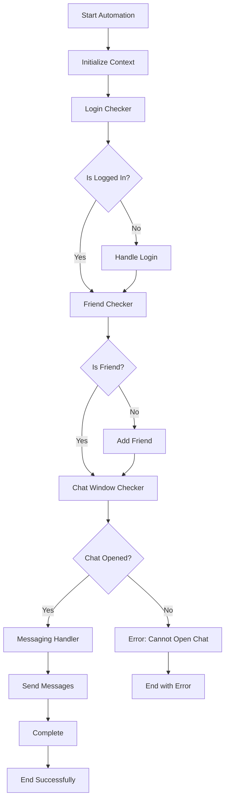
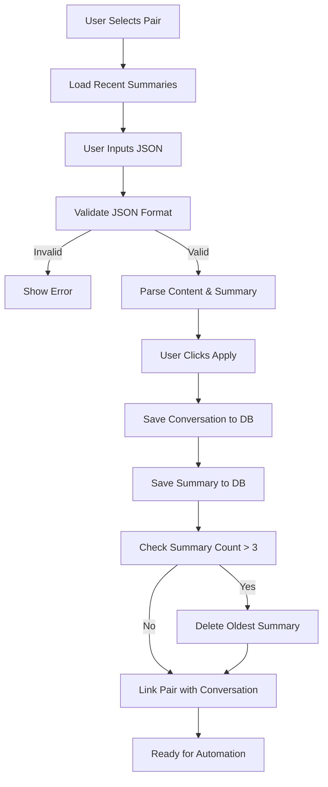

# Thiết Kế Lại Kiến Trúc Zalo Automation System

## 1. Tổng Quan

Việc thiết kế lại nhằm chia nhỏ logic từ core1.py (5000+ dòng) thành các module riêng biệt, dễ bảo trì và mở rộng. Đồng thời xây dựng hệ thống quản lý conversation và cặp thiết bị hoàn chỉnh.

## 2. Kiến Trúc Module Mới

### 2.1 Cấu Trúc Thư Mục
```
automation/
├── core/
│   ├── __init__.py
│   ├── base_step.py          # Base class cho tất cả steps
│   └── step_manager.py       # Quản lý flow execution
├── steps/
│   ├── __init__.py
│   ├── login_checker.py      # Module check đăng nhập
│   ├── friend_checker.py     # Module check bạn bè
│   ├── chat_window_checker.py # Module check cửa sổ chat
│   └── messaging_handler.py  # Module nhắn tin
├── models/
│   ├── __init__.py
│   ├── device_pair.py        # Model cặp thiết bị
│   ├── conversation.py       # Model conversation
│   └── summary.py           # Model summary
└── utils/
    ├── __init__.py
    └── device_utils.py       # Utilities cho thiết bị
```

### 2.2 Base Step Class
```python
# automation/core/base_step.py
from abc import ABC, abstractmethod
from typing import Dict, Any, Optional

class BaseStep(ABC):
    def __init__(self, name: str):
        self.name = name
        self.is_completed = False
        self.error_message: Optional[str] = None
    
    @abstractmethod
    async def execute(self, context: Dict[str, Any]) -> Dict[str, Any]:
        """Thực thi step và trả về context được cập nhật"""
        pass
    
    @abstractmethod
    async def validate(self, context: Dict[str, Any]) -> bool:
        """Kiểm tra điều kiện trước khi thực thi"""
        pass
    
    def mark_completed(self):
        self.is_completed = True
    
    def mark_failed(self, error: str):
        self.error_message = error
```

### 2.3 Step Manager
```python
# automation/core/step_manager.py
from typing import List, Dict, Any
from .base_step import BaseStep

class StepManager:
    def __init__(self):
        self.steps: List[BaseStep] = []
        self.current_step_index = 0
    
    def add_step(self, step: BaseStep):
        self.steps.append(step)
    
    async def execute_flow(self, initial_context: Dict[str, Any]) -> Dict[str, Any]:
        context = initial_context.copy()
        
        for i, step in enumerate(self.steps):
            self.current_step_index = i
            
            # Validate trước khi thực thi
            if not await step.validate(context):
                step.mark_failed(f"Validation failed for step: {step.name}")
                break
            
            try:
                context = await step.execute(context)
                step.mark_completed()
            except Exception as e:
                step.mark_failed(str(e))
                break
        
        return context
```

## 3. Các Module Steps Chi Tiết

### 3.1 Login Checker
```python
# automation/steps/login_checker.py
from ..core.base_step import BaseStep
from typing import Dict, Any

class LoginChecker(BaseStep):
    def __init__(self):
        super().__init__("Login Checker")
    
    async def validate(self, context: Dict[str, Any]) -> bool:
        return "device" in context and context["device"] is not None
    
    async def execute(self, context: Dict[str, Any]) -> Dict[str, Any]:
        device = context["device"]
        
        # Logic check đăng nhập
        login_elements = [
            "com.zing.zalo:id/login_button",
            "com.zing.zalo:id/phone_input",
            "com.zing.zalo:id/password_input"
        ]
        
        is_logged_in = True
        for element_id in login_elements:
            if device.exists(resourceId=element_id):
                is_logged_in = False
                break
        
        context["is_logged_in"] = is_logged_in
        context["login_status"] = "logged_in" if is_logged_in else "need_login"
        
        return context
```

### 3.2 Friend Checker
```python
# automation/steps/friend_checker.py
from ..core.base_step import BaseStep
from typing import Dict, Any, List

class FriendChecker(BaseStep):
    def __init__(self):
        super().__init__("Friend Checker")
    
    async def validate(self, context: Dict[str, Any]) -> bool:
        return context.get("is_logged_in", False)
    
    async def execute(self, context: Dict[str, Any]) -> Dict[str, Any]:
        device = context["device"]
        target_phone = context.get("target_phone")
        
        # Logic check bạn bè
        friends_list = await self._get_friends_list(device)
        is_friend = target_phone in friends_list
        
        context["is_friend"] = is_friend
        context["friends_list"] = friends_list
        context["friend_status"] = "friend" if is_friend else "not_friend"
        
        return context
    
    async def _get_friends_list(self, device) -> List[str]:
        # Implementation để lấy danh sách bạn bè
        pass
```

### 3.3 Chat Window Checker
```python
# automation/steps/chat_window_checker.py
from ..core.base_step import BaseStep
from typing import Dict, Any

class ChatWindowChecker(BaseStep):
    def __init__(self):
        super().__init__("Chat Window Checker")
    
    async def validate(self, context: Dict[str, Any]) -> bool:
        return context.get("is_friend", False)
    
    async def execute(self, context: Dict[str, Any]) -> Dict[str, Any]:
        device = context["device"]
        target_phone = context["target_phone"]
        
        # Logic check và mở cửa sổ chat
        chat_opened = await self._open_chat_window(device, target_phone)
        
        context["chat_window_opened"] = chat_opened
        context["chat_status"] = "opened" if chat_opened else "failed_to_open"
        
        return context
    
    async def _open_chat_window(self, device, target_phone: str) -> bool:
        # Implementation để mở cửa sổ chat
        pass
```

### 3.4 Messaging Handler
```python
# automation/steps/messaging_handler.py
from ..core.base_step import BaseStep
from typing import Dict, Any, List

class MessagingHandler(BaseStep):
    def __init__(self):
        super().__init__("Messaging Handler")
    
    async def validate(self, context: Dict[str, Any]) -> bool:
        return context.get("chat_window_opened", False)
    
    async def execute(self, context: Dict[str, Any]) -> Dict[str, Any]:
        device = context["device"]
        messages = context.get("messages", [])
        
        sent_messages = []
        for message in messages:
            success = await self._send_message(device, message)
            if success:
                sent_messages.append(message)
            else:
                break
        
        context["sent_messages"] = sent_messages
        context["messaging_status"] = "completed" if len(sent_messages) == len(messages) else "partial"
        
        return context
    
    async def _send_message(self, device, message: str) -> bool:
        # Implementation để gửi tin nhắn
        pass
```

## 4. Database Schema

### 4.1 Device Pairs Table
```sql
CREATE TABLE device_pairs (
    id UUID PRIMARY KEY DEFAULT gen_random_uuid(),
    device_a_id VARCHAR(255) NOT NULL,
    device_b_id VARCHAR(255) NOT NULL,
    device_a_phone VARCHAR(20),
    device_b_phone VARCHAR(20),
    pair_name VARCHAR(100),
    status VARCHAR(20) DEFAULT 'active',
    created_at TIMESTAMP WITH TIME ZONE DEFAULT NOW(),
    updated_at TIMESTAMP WITH TIME ZONE DEFAULT NOW(),
    UNIQUE(device_a_id, device_b_id)
);
```

### 4.2 Conversations Table
```sql
CREATE TABLE conversations (
    id UUID PRIMARY KEY DEFAULT gen_random_uuid(),
    pair_id UUID REFERENCES device_pairs(id) ON DELETE CASCADE,
    conversation_data JSONB NOT NULL,
    temp_id VARCHAR(100), -- ID tạm thời từ frontend
    status VARCHAR(20) DEFAULT 'draft',
    created_at TIMESTAMP WITH TIME ZONE DEFAULT NOW(),
    updated_at TIMESTAMP WITH TIME ZONE DEFAULT NOW()
);
```

### 4.3 Conversation Summaries Table
```sql
CREATE TABLE conversation_summaries (
    id UUID PRIMARY KEY DEFAULT gen_random_uuid(),
    pair_id UUID REFERENCES device_pairs(id) ON DELETE CASCADE,
    summary_data JSONB NOT NULL,
    sequence_number INTEGER NOT NULL,
    created_at TIMESTAMP WITH TIME ZONE DEFAULT NOW(),
    UNIQUE(pair_id, sequence_number)
);

-- Index để tối ưu query
CREATE INDEX idx_summaries_pair_sequence ON conversation_summaries(pair_id, sequence_number DESC);
```

### 4.4 Automation Sessions Table
```sql
CREATE TABLE automation_sessions (
    id UUID PRIMARY KEY DEFAULT gen_random_uuid(),
    pair_id UUID REFERENCES device_pairs(id) ON DELETE CASCADE,
    conversation_id UUID REFERENCES conversations(id) ON DELETE CASCADE,
    status VARCHAR(20) DEFAULT 'pending',
    started_at TIMESTAMP WITH TIME ZONE,
    completed_at TIMESTAMP WITH TIME ZONE,
    error_message TEXT,
    created_at TIMESTAMP WITH TIME ZONE DEFAULT NOW()
);
```

## 5. API Endpoints

### 5.1 Device Pairs Management
```typescript
// GET /api/device-pairs
// Lấy danh sách cặp thiết bị

// POST /api/device-pairs
// Tạo cặp thiết bị mới
interface CreatePairRequest {
    deviceAId: string;
    deviceBId: string;
    deviceAPhone?: string;
    deviceBPhone?: string;
    pairName?: string;
}

// PUT /api/device-pairs/:id
// Cập nhật cặp thiết bị

// DELETE /api/device-pairs/:id
// Xóa cặp thiết bị
```

### 5.2 Conversations Management
```typescript
// POST /api/conversations
// Tạo conversation mới
interface CreateConversationRequest {
    pairId: string;
    tempId: string;
    conversationData: {
        conversation: Array<{
            role: 'device_a' | 'device_b';
            content: string;
        }>;
        summary: {
            noidung: string;
            hoancanh: string;
            so_cau: number;
        };
    };
}

// GET /api/conversations/:pairId
// Lấy conversations của một cặp

// PUT /api/conversations/:id/apply
// Apply conversation để chạy automation
```

### 5.3 Summaries Management
```typescript
// GET /api/summaries/:pairId
// Lấy 3 summaries gần nhất của cặp

// POST /api/summaries
// Tạo summary mới (tự động xóa cũ nếu > 3)
interface CreateSummaryRequest {
    pairId: string;
    summaryData: {
        noidung: string;
        hoancanh: string;
        so_cau: number;
    };
}
```

### 5.4 Automation Control
```typescript
// POST /api/automation/start
// Bắt đầu automation session
interface StartAutomationRequest {
    pairId: string;
    conversationId: string;
}

// POST /api/automation/stop/:sessionId
// Dừng automation session

// GET /api/automation/status/:sessionId
// Lấy trạng thái automation session
```

## 6. Frontend UI Design

### 6.1 Conversation Input Component
```typescript
interface ConversationInputProps {
    pairId: string;
    onApply: (data: ConversationData) => void;
}

interface ConversationData {
    tempId: string;
    conversation: Message[];
    summary: Summary;
}

interface Message {
    role: 'device_a' | 'device_b';
    content: string;
}

interface Summary {
    noidung: string;
    hoancanh: string;
    so_cau: number;
}
```

### 6.2 UI Layout
```
┌─────────────────────────────────────────────────────────────┐
│ Conversation Input                                          │
├─────────────────────────────────────────────────────────────┤
│ Pair: [Dropdown chọn cặp thiết bị]                         │
│                                                             │
│ JSON Input:                                                 │
│ ┌─────────────────────────────────────────────────────────┐ │
│ │ {                                                       │ │
│ │   "conversation": [                                     │ │
│ │     {"role": "device_a", "content": "ê"},              │ │
│ │     {"role": "device_b", "content": "gì đó"}           │ │
│ │   ],                                                    │ │
│ │   "summary": {                                          │ │
│ │     "noidung": "...",                                   │ │
│ │     "hoancanh": "...",                                  │ │
│ │     "so_cau": 65                                        │ │
│ │   }                                                     │ │
│ │ }                                                       │ │
│ └─────────────────────────────────────────────────────────┘ │
│                                                             │
│ [Apply] [Clear] [Load from File]                           │
├─────────────────────────────────────────────────────────────┤
│ Recent Summaries for Selected Pair:                        │
│ • Summary 1: "Nội dung tóm tắt..." (2024-01-15)           │
│ • Summary 2: "Nội dung tóm tắt..." (2024-01-14)           │
│ • Summary 3: "Nội dung tóm tắt..." (2024-01-13)           │
└─────────────────────────────────────────────────────────────┘
```

## 7. Flow Hoạt Động

### 7.1 Automation Flow


### 7.2 Conversation Management Flow


### 7.3 Summary Management Logic
```python
# Logic quản lý 3 summaries gần nhất
async def save_summary(pair_id: str, summary_data: dict):
    # Lấy số lượng summaries hiện tại
    current_count = await get_summary_count(pair_id)
    
    if current_count >= 3:
        # Xóa summary cũ nhất
        await delete_oldest_summary(pair_id)
    
    # Tạo sequence number mới
    max_sequence = await get_max_sequence(pair_id)
    new_sequence = max_sequence + 1
    
    # Lưu summary mới
    await create_summary({
        'pair_id': pair_id,
        'summary_data': summary_data,
        'sequence_number': new_sequence
    })
```

## 8. Deployment và Configuration

### 8.1 Environment Variables
```env
# Database
SUPABASE_URL=your_supabase_url
SUPABASE_ANON_KEY=your_anon_key
SUPABASE_SERVICE_KEY=your_service_key

# Automation
AUTOMATION_TIMEOUT=300000
MAX_RETRY_ATTEMPTS=3
STEP_DELAY=1000

# Logging
LOG_LEVEL=info
LOG_FILE_PATH=./logs/automation.log
```

### 8.2 Configuration Files
```json
// automation_config.json
{
  "steps": {
    "login_checker": {
      "timeout": 30000,
      "retry_attempts": 3
    },
    "friend_checker": {
      "timeout": 45000,
      "retry_attempts": 2
    },
    "chat_window_checker": {
      "timeout": 20000,
      "retry_attempts": 3
    },
    "messaging_handler": {
      "message_delay": 2000,
      "timeout": 60000
    }
  },
  "ui_elements": {
    "login_button": "com.zing.zalo:id/login_button",
    "chat_input": "com.zing.zalo:id/chat_input",
    "send_button": "com.zing.zalo:id/send_button"
  }
}
```

## 9. Testing Strategy

### 9.1 Unit Tests
- Test từng step riêng biệt
- Mock device interactions
- Test validation logic

### 9.2 Integration Tests
- Test flow hoàn chỉnh
- Test database operations
- Test API endpoints

### 9.3 E2E Tests
- Test với thiết bị thật
- Test UI interactions
- Test automation scenarios

## 10. Migration Plan

### 10.1 Phase 1: Core Infrastructure
- Tạo base classes và step manager
- Setup database schema
- Implement basic API endpoints

### 10.2 Phase 2: Step Implementation
- Migrate logic từ core1.py
- Implement từng step module
- Test individual steps

### 10.3 Phase 3: UI Integration
- Implement conversation input UI
- Integrate với backend APIs
- Test end-to-end flow

### 10.4 Phase 4: Production Deployment
- Performance optimization
- Error handling improvements
- Monitoring và logging

Việc thiết kế này sẽ giúp hệ thống dễ bảo trì, mở rộng và debug hơn so với core1.py hiện tại.